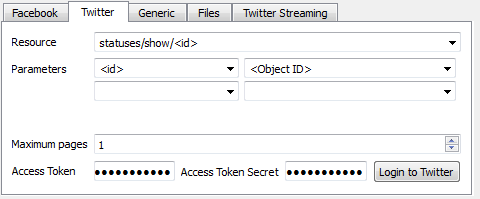

Title: A workaround for Twitter's Search-API limitations: Using the Twitter Websearch and Facepager
Date: 2015-11-27
Siteurl: Websearch
Tags: Facepager, Twitter, JavaScript
Summary: Twitter Websearch and Facepager

While API's in general enrich and simplify the process of (automated) data collection (not just for business cases, but for scientific purposes as
well), these structured and well-defined data access-points have some drawbacks. One of them is the access to 'historical' data, that might be 
restricted, as in the case of the Twitter restful Search-API. The [documentation](https://dev.twitter.com/rest/public/search) states: 

*"Also note that the search results at twitter.com may return historical results while the Search API usually only serves tweets from 
the past week."*

Thus, most sample-strategies that rest upon hash tag-querries are restricted (assuming no other (paid) data provider like GNIP etc. is used) 
to contemporary Tweets no older than ~1 week. Especially student's research projects without any  financial resources at hand might fail due to these restrictions, 
because these projects do often rely on historical hash tags analysis (wildly inferred from the incoming questions regarding the Facpager-Tool).

There is, however, a simple method to access Tweets older than 1 Week (Note: this limitation concerns only the #-Search via the REST-API!):
The [Twitter-Websearch](https://twitter.com/search-advanced) does not underlie these restriction and provides access to older/historical Tweets.
Especially the "Advanced-Search" has some nice options to specify the time-frame etc., so that it's a really helpfull interface for (scientific) analyses.
While there are lesser restrictions upon the Websearch, it lacks the option to save the Tweet-data in a structured form like the API-variant (using Facepager or whatever tool) provides.
Due to the fact that the target audience for the Facepager has little or no programming knowledge, programming a WebScraper is usually not an option. 
There might be some Scraper out there (see [1](http://idatassist.com/20-minutes-to-scraping-twitter-for-building-target-lists-no-coding/),[2](http://sysnucleus-blog.com/2014/07/15/how-to-scrape-tweets-twitter-data-scraping-using-webharvy/),[3](http://sysnucleus-blog.com/2014/07/15/how-to-scrape-tweets-twitter-data-scraping-using-webharvy/))
, but the easiest way to combine the power of the Websearch and well-defined data-structure of the API is the following:

**1. Define your Websearch.**   
    I'd suggest using the "Advanced" Option.  

  

**2. Restrict:**  
Select "Live" or restrict the Search-Output to Tweets, assuming that you're only interested in Tweets (and not Accounts or Photos etc.)  

**3. Paginate:**  
You can scroll through these results. Depending on the amount of Tweets, new ones will load once you reach the end of the page.  

   To facilitate the tedious task of scrolling through the result, use this bookmarklet (drag & drop to your bookmark-bar, click on it while on the
   results-page and repeat the process)  

   &nbsp;&nbsp;&nbsp;&nbsp;&nbsp;&nbsp;<a class='bml' href='javascript: $("html, body").animate({ scrollTop: $(document).height()-$(window).height() });')> Paginate Results Bookmarklet</a>
    

**4. Collect ID's:**   
If you are done collecting results, use the second bookmarklet. This one will open a new window (be sure to enable pop-ups!) that contains the ID of the Tweets.
  

&nbsp;&nbsp;&nbsp;&nbsp;&nbsp;&nbsp;<a class 'bml' href='javascript: window.open("data:data:attachment/csv," + encodeURIComponent($.map($(".js-stream-item"), function (i) {     return $(i).attr("data-item-id"); }).join("\n")),"neu.csv");'> Extract Tweets </a>
  

Copy & paste these ID's. 

**5. Facepager:**  
   In this step, add the ID's by clicking the "Add nodes"-button and paste the ID's into the window.
   You should see the ID's as new nodes in the main window of the Facepager. 
   Up to this point, no Tweet data (except the ID's itself, of course) has been collected.

**6. Collect data:**   
   Use a Facepager-Setup to collect Tweets. It's quite likely that you want to use the following settings:
   

   

7. Collect the data (you can select multiple or all ID's at once)

*Some notes and further details:*

- This is tested in Chrome (46.0.2490.8), but it should work in Firefox as well
- Yes, one can automate the pagination process without clicking the Bookmarklet a couple of times. I do not consider this a good practice
- This type of data collection (the Websearch-Scraping part in steps 1-3) might not be supported/intended by Twitter.
  Be sure to reduce your results using the search features and do not simply collect a vast amount of data.
- This is a quick&dirty solution to the problem - feel free to improve it!
  
